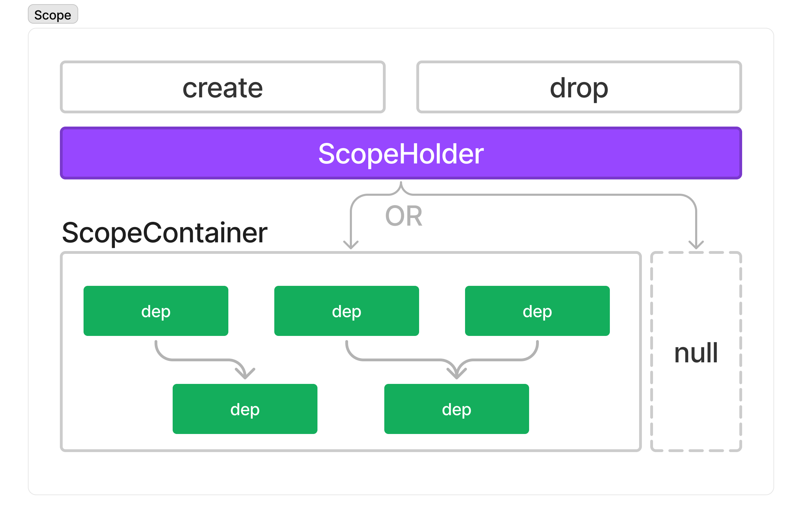

## yx_scope

yx_scope is a compile-safe DI framework with advanced scoping capabilities.

## Library Components

The library group currently consists of:

- **yx_scope**: The core implementation of the framework
- **yx_scope_flutter**: An adapter library that allows embedding yx_scope containers into the widget
  tree
- **yx_scope_linter**: A set of custom lint rules that provide additional protection against errors
  when working with yx_scope

## Features

- Pure Dart
- DI-like (not static and not ServiceLocator)
- Compile-safe access to dependencies
- No code generation
- Flutter-friendly container management
- Declarative description of the dependency tree
- Non-reactive dependency tree
- Unambiguous behavior and lifecycle of dependencies in containers
- Ability to create scopes of any nesting level
- Compile-safe check for the existence of active scopes
- Support for asynchronous dependencies and their initialization
- Compile-safe protection against circular dependencies

## Quick Start

Let's look at a simple dependency container. First, add yx_scope to your pubspec.yaml:

```yaml
dependencies:
    yx_scope: ^1.0.0
```

Create a file named `app_scope.dart` and add the description of our container and dependencies:

```dart
class AppScopeContainer extends ScopeContainer {
  late final routerDelegateDep = dep(() => AppRouterDelegate());

  late final appStateObserverDep = dep(
        () =>
        AppStateObserver(
          routerDelegateDep.get,
        ),
  );
}

class AppScopeHolder extends ScopeHolder<AppScopeContainer> {
  @override
  AppScopeContainer createContainer() => AppScopeContainer();
}
```

Now, let's create an `AppScopeHolder`, create a container, and access the dependencies:

```dart
void main() async {
  final appScopeHolder = AppScopeHolder();
  await appScopeHolder.create();

  final appScope = appScopeHolder.scope;
  if (appScope != null) {
    final AppStateObserver appStateObserver = appScope.appStateObserverDep.get;
  }
}
```

An important feature of the library is that we work with the DI container without binding it to the
UI. The DI container is primary, and only as an addition to this, the container can be attached to
the UI.

The DI container is created as a reaction to an event in the application's logic, not as a result of
the appearance of some screen or UI element. UI does not generate scopes; scopes generate UI.

This is an important principle of the mechanics of yx_scope.

## Key Entities

- **Dep (dependency)**: A container for one specific instance of any entity.
- **ScopeContainer**: An isolated, non-overlapping set of dependencies united by a meaningful scope
  and sharing a common lifecycle.
- **ScopeHolder**: An instance that stores the current state of the container and is responsible for
  its initialization and disposal.

> A ScopeContainer can be closed by some public interface, hiding implementation details and access
> to Dep. In this case, the interface for it will have the suffix Scope, for example, AccountScope.

`ScopeHolder` is responsible for creating and removing the scope using the `create` and `drop`
methods.

Initially, `ScopeHolder` contains a null state.

After calling the `create` method, a scope appears - a container with dependencies that can be
accessed through the `ScopeHolder`.

After the `drop` method, all scope dependencies are disposed - the `ScopeHolder` again contains
null.

Due to null-safety, `ScopeHolder` provides a compile-safe check for the existence of a scope
directly
at the time of writing code, not at runtime.


